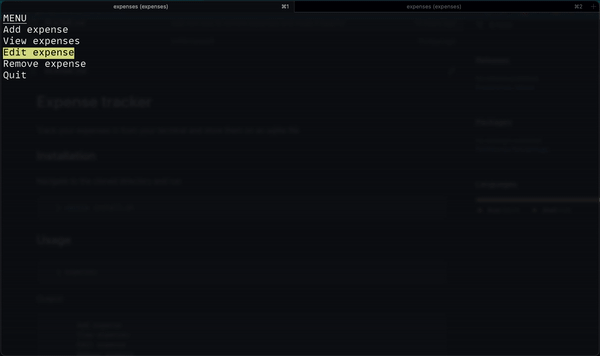

# Expense tracker

Track your expenses in from your terminal with a simple UI

----
**A `db.sqlite` file will be created in the `/home/[user]/expenses` directory that will store all your expenses.**

----

# Installation

Navigate to the cloned directory and run

```bash
$ source install.sh
```

# Usage

```bash
$ expenses
```

# Example Usage




